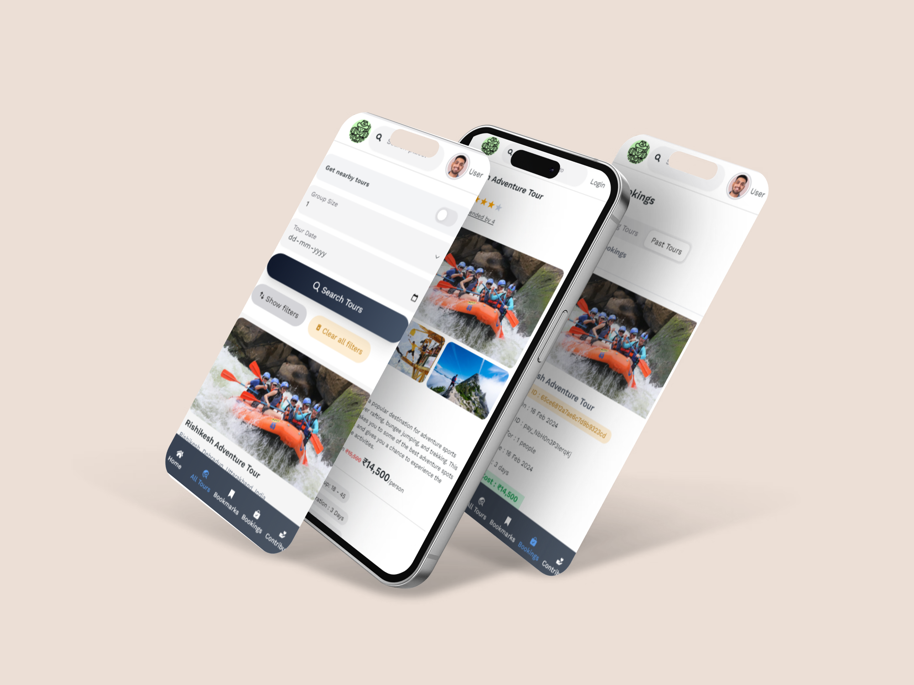

<a name="readme-top"></a>

<!-- PROJECT LOGO -->
<br />
<div align="center">
  <a href="https://adventour-explore.vercel.app">
    
  </a>

  <p align="center">
   <h4  style="font-size: 27px; font-weight: bold">ADVENTOUR</h4>
   <i>Your journey, our expertise!</i>
  </p>
    <a href="https://adventour-explore.vercel.app">View Demo</a>
    ·
    <a href="https://adventour-explore.vercel.app/admin">View Admin Panel</a>
    ·
    <a href="https://github.com/TusharGaonkar/AdvenTour-Frontend/issues/new">Request Feature</a>
  </p>
  
</div>

<div align="center">




</div>

<!-- ABOUT THE PROJECT -->

## ℹ️ About

AdvenTour is a platform that connects adventure seekers with local tour guides. It allows users to explore and book adventure tours in their nearby areas based on their preferences. Tour guides can easily list and promote their offerings on the platform, providing detailed information about the adventures they lead. With AdvenTour, adventure enthusiasts can discover and experience new unexplored places in their vicinity, guided by knowledgeable locals who know the area best.

<p align="right">(<a href="#readme-top">back to top</a>)</p>

### 🛠️Built With

`Tech stack of AdvenTour Frontend`

[](https://www.typescriptlang.org/)
[](https://reactjs.org/)
[](https://redux.js.org/)
[](https://redux-toolkit.js.org/)
[](https://nextui.org/)
[](https://tailwindcss.com/)
[](https://github.com/colinhacks/zod)
[](https://react-hook-form.com/)
[](https://razorpay.com/)
[](https://vercel.com/)
[](https://vitejs.dev/)

<p align="right">(<a href="#readme-top">back to top</a>)</p>

<!-- Features -->

## ✨Key Features

### For Travelers:

- **`Wide Range of Adventure Tours`**: Access to over 30+ genres of adventure tours, including hiking, rafting, rock climbing, safari, and more.
- **`Location-Based Filtering`**: Easily find tours near your current location, making spontaneous adventures a breeze.
- **`Advanced Search Filters`**:
  - **`Hardness Levels`**: Select tours based on difficulty, ensuring suitability for all experience levels.
  - **`Genres`**: Choose from various adventure types.
  - **`Duration`**: Filter tours by the number of days to fit your schedule.
  - **`Age Restrictions`**: Find tours appropriate for different age groups.
  - **`Ratings`**: Filter tours based on their ratings.
- **`Booking System`**: Seamlessly book your chosen adventure tour directly through the platform.
- **`Responsive Design`**: The platform is fully responsive, providing a smooth experience on both desktop and mobile devices.

### For Guides:

- **`Tour Uploading`**: Guides can upload and manage adventure places where they offer their guiding services.
- **`Track Booking`**: Guides can track and manage all bookings, ensuring smooth operation.

### Admin Panel:

- **`Verify adventure tours`**: Admins can verify and approve/reject tours uploaded by guides.
- **`Booking management`**: Admins can track and manage all bookings, cancel and refund bookings.
- **`User Management`**: Oversee both travelers and guides, contact users directly through the platform.

## 🚀Optimizations

- **Web Vitals**: Improved the application performance by optimizing the `First Contentful Paint (FCP)` and `Largest Contentful Paint (LCP)` scores according to Web Vitals standards. This was achieved by compressing assets and serving them through `Cloudinary CDN`. Additionally, optimized the overall page load time by implementing `preloading`, `preconnect`, `lazy loading`, and `client-side caching` techniques using `RTK Query`. Furthermore, enhanced the search input functionality by integrating `debouncing`.
- **Dynamic Form Validation**: Utilized `React Hook Form` along with `Zod` to handle complex file and dynamic element validations, preventing unwanted re-rendering of form fields.
- **Custom Components and Higher-Order Components**: Designed custom hooks and higher-order components from scratch

## 🔧Setting up the project locally

To set up the project locally, follow these steps:

1. Clone the repository: `git clone https://github.com/TusharGaonkar/AdvenTour-Frontend.git`
2. Navigate to the project directory: `cd AdvenTour-Frontend`

3. Set environment variables:
   Create a `.env` file in the project root directory with the following content and save it

```bash
VITE_ADVENTOUR_BACKEND_URL = "https://adventour.live/api/v-1.0"

VITE_MAPBOX_TOKEN = "pk.eyJ1IjoidHVzaGFyZGciLCJhIjoiY2xwOGQxbmozMms3bzJrczRla2wzZDk1aiJ9.Gj3D87Qq2LxjfYlt-ARpxA"

VITE_RAZORPAY_GETKEY_URL = "https://adventour.live/api/v-1.0/bookings/getKeyID"

VITE_RAZORPAY_CREATE_ORDER_URL = "https://adventour.live/api/v-1.0/bookings/createOrder"

VITE_RAZORPAY_CALLBACK_URL = "https://adventour.live/api/v-1.0/bookings/verifyPayment"

```

4. Install dependencies: `npm install`
5. Start the development server: `npm run start`
6. Project will be live at `http://localhost:5173`

⚠️Please note that some of the redirects from the backend might not work in development mode, for example the Google authentication and the booking success redirect to the bookings page.

Please note that google

<!--Contributing -->

## 🤝Contributing

If you have a suggestion that would make this better, please fork the repo and create a pull request.

1. Fork the Project
2. Create your Feature Branch (`git checkout -b feature/AmazingFeature`)
3. Commit your Changes (`git commit -m 'Add some AmazingFeature'`)
4. Push to the Branch (`git push origin feature/AmazingFeature`)
5. Open a Pull Request

Interested in contributing to the backend? Check out [Backend Repo](https://github.com/TusharGaonkar/AdvenTour-Backend)

<p align="right">(<a href="#readme-top">back to top</a>)</p>

## 📨Contact

Feel free to reach out if you have any queries or suggestions to improve👍

Tushar Gaonkar - gaonkar.tushar01@gmail.com

```

```
